# Web Striker 4.0 /Web-Scraper

Welcome to the detailed documentation for **Web Striker 4.0**! This project provides a full-stack web application to scrape website content, summarize it using advanced LLMs (Large Language Models), and interact with a chatbot based on the scraped content. The app features model switching and a user-friendly interface.

**🌐 [Visit the live website here!](https://web-scraper-main.onrender.com/)**

---

## Overview

- **Backend:** Python (Flask) with LLM processing and web scraping.
- **Frontend:** HTML, CSS, and JavaScript for an interactive UI.
- **Features:**
  - Scrape web content from any URL.
  - Summarize scraped data via LLM models (Groq API).
  - Chatbot for Q&A about scraped content.
  - Switch between LLM models dynamically.

---

## Project Structure

| Filename              | Purpose                                                                                      |
|-----------------------|----------------------------------------------------------------------------------------------|
| `app.py`              | Main Flask backend, REST API endpoints, and routing.                                         |
| `scraper.py`          | Web scraping, text cleaning, summarization, chatbot, and model selection logic.              |
| `llm_processor.py`    | (Unused currently) Summarization with llama_index and GPTListIndex.                          |
| `index.html`          | Main frontend UI; includes all JavaScript for interaction.                                   |
| `style.css`           | Additional styles for alternate frontend (not used by current index.html).                   |
| `tempCodeRunnerFile.py` | Contains a Groq API key (security risk, do not commit!).                                   |

---

## Backend: `app.py`

This is the **Flask web server**. It exposes all REST API endpoints, serves the frontend, and handles requests for scraping, summarization, chat, and model selection.

### Key Features

- **CORS** enabled for frontend-backend communication.
- **API endpoints**:
  - `/` : Serves the main HTML page.
  - `/scrape` : Accepts a URL, returns scraped text and summary.
  - `/chat` : Accepts a user message + context, returns LLM response.
  - `/select_model` : Allows switching between LLM models.


---

### API Endpoints

#### 1. Home Page

```api
{
    "title": "Home Page",
    "description": "Serve the main frontend HTML page.",
    "method": "GET",
    "baseUrl": "https://web-scraper-main.onrender.com",
    "endpoint": "/",
    "headers": [],
    "queryParams": [],
    "pathParams": [],
    "bodyType": "none",
    "requestBody": "",
    "formData": [],
    "responses": {
        "200": {
            "description": "HTML content of the main page",
            "body": "<!DOCTYPE html>..."
        }
    }
}
```

#### 2. Scrape and Summarize

```api
{
    "title": "Scrape and Summarize Website",
    "description": "Scrapes website content and summarizes it using the selected LLM.",
    "method": "POST",
    "baseUrl": "https://web-scraper-main.onrender.com",
    "endpoint": "/scrape",
    "headers": [
        {"key": "Content-Type", "value": "application/json", "required": true}
    ],
    "queryParams": [],
    "pathParams": [],
    "bodyType": "json",
    "requestBody": "{ \"url\": \"https://example.com\" }",
    "formData": [],
    "responses": {
        "200": {
            "description": "Scraped text and summary",
            "body": "{\n  \"scraped_text\": \"...extracted text...\",\n  \"summary\": \"...summarized content...\"\n}"
        },
        "400": {
            "description": "Missing URL error.",
            "body": "{ \"error\": \"URL is required\" }"
        },
        "500": {
            "description": "Internal error",
            "body": "{ \"error\": \"An error occurred: ...\" }"
        }
    }
}
```

#### 3. Chat with LLM

```api
{
    "title": "Chat with LLM",
    "description": "Chatbot endpoint, provides answers based on user message and context.",
    "method": "POST",
    "baseUrl": "https://web-scraper-main.onrender.com",
    "endpoint": "/chat",
    "headers": [
        {"key": "Content-Type", "value": "application/json", "required": true}
    ],
    "queryParams": [],
    "pathParams": [],
    "bodyType": "json",
    "requestBody": "{ \"message\": \"What is this page about?\", \"context\": \"...scraped text and summary...\" }",
    "formData": [],
    "responses": {
        "200": {
            "description": "LLM generated response",
            "body": "{ \"response\": \"...AI answer...\" }"
        },
        "400": {
            "description": "Missing message error.",
            "body": "{ \"error\": \"Message is required\" }"
        },
        "500": {
            "description": "Internal error",
            "body": "{ \"error\": \"An error occurred: ...\" }"
        }
    }
}
```

#### 4. Select LLM Model

```api
{
    "title": "Select LLM Model",
    "description": "Switches the active LLM model for summarization and chat.",
    "method": "POST",
    "baseUrl": "https://web-scraper-main.onrender.com",
    "endpoint": "/select_model",
    "headers": [
        {"key": "Content-Type", "value": "application/json", "required": true}
    ],
    "queryParams": [],
    "pathParams": [],
    "bodyType": "json",
    "requestBody": "{ \"model\": \"Gemma2 💎\" }",
    "formData": [],
    "responses": {
        "200": {
            "description": "Model changed successfully",
            "body": "{ \"message\": \"Model changed to Gemma2 💎\" }"
        },
        "400": {
            "description": "Missing or invalid model error.",
            "body": "{ \"error\": \"Model name is required\" }"
        },
        "500": {
            "description": "Internal error",
            "body": "{ \"error\": \"An error occurred: ...\" }"
        }
    }
}
```

---

## Web Scraping & LLM Integration: `scraper.py`

This file handles all the **core logic** for scraping, cleaning, summarizing, chatting, and model management.

### Features

- **Web Scraping:** Uses `requests` and `BeautifulSoup` to extract visible text from a webpage.
- **Text Cleaning:** Removes scripts, styles, navigation, special characters, and excess whitespace.
- **Summarization:** Calls Groq API models for concise summaries.
- **Chatbot:** Uses context from scraped text and summary to answer user queries.
- **Model Selection:** Switch between multiple LLMs (Gemma2, Llama3.1, Mixtral).

### Model Management

| Model Name         | Internal Key            | Emoji    |
|--------------------|------------------------|----------|
| Gemma2             | gemma2-9b-it           | 💎       |
| Llama3.1           | llama-3.1-8b-instant   | 🦙       |
| Mixtral New        | mixtral-8x7b-32768     | 🚀       |


### Core Functions

#### 1. `scrape_website(url)`

- **Purpose:** Extracts visible/meaningful text from a web page.
- **Process:**
  - Requests URL, parses with BeautifulSoup
  - Removes `<script>`, `<style>`, `<nav>`, `<footer>`, `<header>`
  - Extracts text from headings and paragraphs
  - Cleans result and truncates if very long

#### 2. `summarize_text(text, model)`

- **Purpose:** Produces a concise summary using selected LLM via Groq API.
- **Process:**
  - Handles errors from scraping phase
  - Truncates text if needed
  - Sends prompt to LLM for summary

#### 3. `chat_with_llm(message, context, model)`

- **Purpose:** Answers user queries, using context from scraped web content and summary.
- **Process:**
  - Builds prompt with context when available
  - Calls LLM for response

#### 4. `select_model(model_name)`

- **Purpose:** Switches the active LLM model for all future summarization/chat.
- **Usage:** Called from frontend or via `/select_model` API.

---

### Model Switching (State Diagram)

```mermaid
stateDiagram-v2
    [*] --> Llama3.1
    Llama3.1 --> Gemma2: select_model('Gemma2 💎')
    Llama3.1 --> Mixtral: select_model('Mixtral New 🚀')
    Gemma2 --> Llama3.1: select_model('Llama3.1 🦙')
    Gemma2 --> Mixtral: select_model('Mixtral New 🚀')
    Mixtral --> Llama3.1: select_model('Llama3.1 🦙')
    Mixtral --> Gemma2: select_model('Gemma2 💎')
```



---

## LLM Summarization: `llm_processor.py`

- **Purpose:** (Not currently used in app.py)
- **Functionality:** Uses `llama_index` and `GPTListIndex` to summarize provided text.
- **Process:**
  - Loads document via `SimpleWebPageReader`
  - Builds index, queries for a summary

> **Note:** This module is not currently invoked by the main codebase, but could be integrated as a fallback or alternative summarizer.

---

## Frontend: `index.html`

This file is the **entire user interface** for Web Striker 4.0 and contains embedded CSS and JavaScript.

### Features

- **Model Selection Dropdown:** Choose between multiple LLMs.
- **Web Scraper Section:** Input a URL, scrape, view text and summary.
- **Chatbot Section:** Ask questions about the scraped content and get contextual answers.
- **Responsive UI** styled for usability.

### UI Components

| Component         | Description                                                      |
|-------------------|------------------------------------------------------------------|
| Model Selector    | Dropdown to switch LLM models                                    |
| URL Input         | Field to provide website URL                                     |
| Scraped Text      | Displays raw extracted content                                   |
| Summary           | Shows LLM-generated summary                                      |
| Chat Box          | History of user/AI messages                                      |
| Chat Input        | Input field to ask questions                                     |

#### Example Flow

1. **User selects a model** (optional).
2. **User enters a URL** and clicks "Scrape and Summarize".
3. Scraped text and its summary appear.
4. **User asks questions** about the content via the chatbot.

---

### JavaScript Data Flow (Sequence Diagram)


---

### Code Highlights

- **AJAX:** Uses `fetch()` for all requests (scraping, chat, model selection).
- **Chat Context:** Passes both scraped text and summary as context to the chatbot.
- **UI Feedback:** Shows loading indicators and error messages for better user experience.

---

## Stylesheet: `style.css`

- **Purpose:** Standalone stylesheet for a simpler version of the UI.
- **Main Features:**
  - Clean, card-like container
  - Blue-themed buttons and highlights
  - Used for a basic layout (not directly applied by current `index.html`)
- **Note:** The main HTML file uses its own embedded styles.

---

## Security Note: `tempCodeRunnerFile.py`

- **Contains:** Groq API Key in plaintext.
- **Warning:** Never commit API keys to public repositories!
- **Best Practice:** Use environment variables or a `.env` file for secret keys.

---

## Summary

- **Web Striker 4.0** is a full-stack solution to scrape, summarize, and chat about any website using advanced LLMs.
- The backend exposes a rich REST API for scraping, summarization, chat, and model selection.
- The frontend makes these features accessible in a modern, conversational interface.
- **Try it live:**  
  👉 [https://web-scraper-main.onrender.com/](https://web-scraper-main.onrender.com/)

---

**Enjoy exploring and expanding the power of web automation and LLMs! 🚀**

